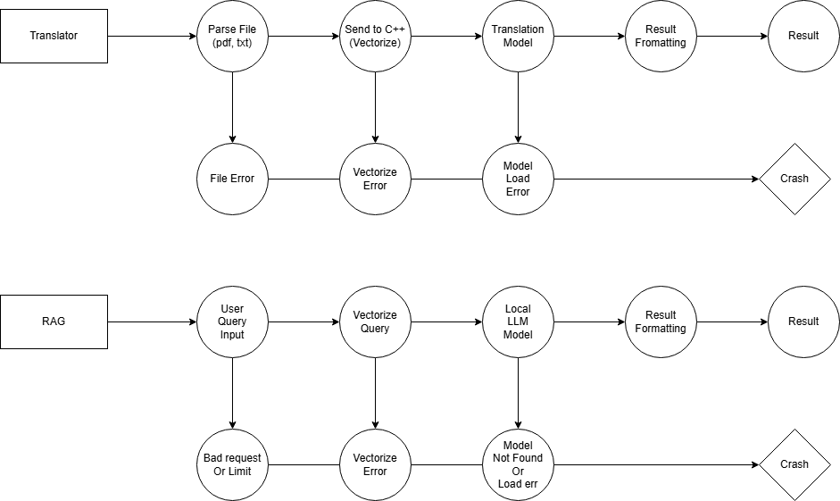

# Build Instructions for Easy PDF Translator

This guide explains how to build the `.exe` file for distribution.

## Prerequisites

1. **Python 3.9+** installed on your development machine
2. **pip** (Python package manager)

## Step-by-Step Build Process

### 1. Set Up Virtual Environment (Recommended)

```bash
# Navigate to project directory
cd /path/to/PDF_Translator_App

# Create virtual environment
python -m venv venv
```

**Activate it:**

- **Windows:**
  ```cmd
  venv\Scripts\activate
  ```

- **Linux/Mac:**
  ```bash
  source venv/bin/activate
  ```

## Future Architecture (This can be changed)

